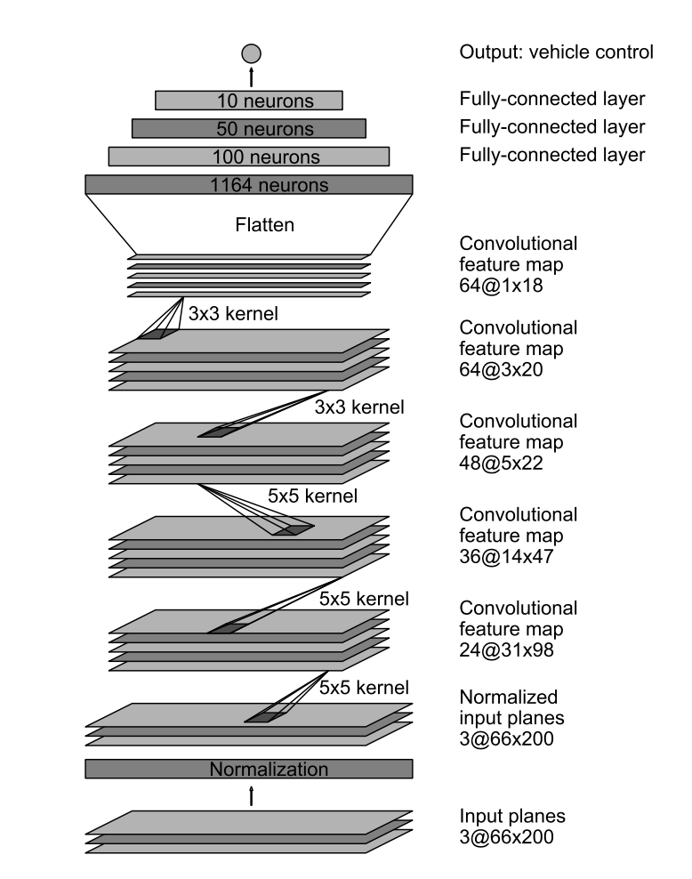

# Udacity Self-Driving Car Engineer Nanodegree - Behavioral Cloning Project

*My solution to the Udacity Self-Driving Car Engineer Nanodegree Behavioral Cloning project.*

**Note: This project makes use of a Udacity-developed driving simulator and training data collected from the simulator (neither of which is included in this repo).**

### Introduction

The objective of this project is to teach the computer to drive car on on the basis of data collected in simulator provided by Udacity [here](.amazonaws.com/video.udacity-data.com/topher/2016/December/584f6edd_data/data.zip). Here the concepts of Deep Learning and Convolutional Neural Networks are applied to teach the computer to drive car autonomously.

I collected the data using the Simulator provided by Udacity and then feeded it to my model. This data is fed in the form of images captured by 3 dashboard cams center, left and right. The output data contains a file data.csv which has the mappings of center, left and right images and the corresponding steering angle, throttle, brake and speed. 

Using Keras Deep learning framework a model.h5 file was created, which sothat the model could be tested using the simulator in autonomous mode with the command "python drive.py model.h5". This drive.py connects the model to simulator. The challenge in this project is to collect all sorts of training data so as to train the model to respond correctly in any type of situation.

Since I also previously took part at Udemy Course for [Self Driving Car](.https://www.udemy.com/course/applied-deep-learningtm-the-complete-self-driving-car-course/) a used the knowledges obtrained from this course to complete this project. 

---

**Behavioral Cloning Project**

The goals / steps of this project are the following:
* Use the simulator to collect data of good driving behavior
* Build, a convolution neural network in Keras that predicts steering angles from images
* Train and validate the model with a training and validation set
* Test that the model successfully drives around track one without leaving the road
* Summarize the results with a written report


### Files Submitted & Code Quality

#### 1. Submission includes all required files and can be used to run the simulator in autonomous mode

My project includes the following files:
* model.py containing the script to create and train the model
* model.ipynb python notebook containing the code to create and train the model
* drive.py for driving the car in autonomous mode
* model.h5 containing a trained convolution neural network 
* writeup_report.md  summarizing the results

#### 2. Submission includes functional code

Using the Udacity provided simulator and my drive.py file, the car can be driven autonomously around the track by executing 
```sh
python drive.py model.h5
```

#### 3. Submission code is usable and readable

The model.py file contains the code for training and saving the convolution neural network. The file shows the pipeline I used for training and validating the model, and it contains comments to explain how the code works.


### Model Architecture and Training Strategy

#### 1. An appropriate model architecture has been employed

* I decided to test the model provided by NVIDIA as suggested by Udacity. The model architecture is described by NVIDIA:  The network has about 27 million connections and 250 thousand
parameters.

As an input this model takes in image of the shape (60,266,3) but our dashboard images/training images are of size (160,320,3). I decided to keep the architecture of the model same but instead preprocess the images to hast the shape of (66, 200, 3).


I applied a whole pipeline of image preprocessing and augmentations steps consisting different techniques described bellow: 


###  Creation of the Training Set & Training Process

To capture good driving behavior, I first recorded 3 laps on track one using center lane driving. Here is an example image of center lane driving:
Since the the track in Simulator has more left curves an decided to drive the car in backward direction for other 3 laps to avoid bias in data and to get more balanced data set.

* Sample Image:


### Preprocessing

Image data preprocessing and augmentation can be used to improve model performance and reduce generalization error.
This process allows creating of new data images using the existing dataset. Since our data set is relatively not big,
some data augmenation techniques must be applied for better model generalization and to avoid overfitting. 
The applied image preprocessing technique are desribed bellow: 

##### Image Zooming 

The first data augmentation technique used is zooming. 
With this step an image can be zoomed in up to 30 percent: 


##### Image Panning 
Now we can move on to our next augmentation technique called `Image Panning` which is essentially just the horizontal or vertical translation of the image.


##### Brightness Altering 
The next augmentation is altering of image brightness. What this function does is essentially playing around with the brightness of the image making it darker or lighter.
The function multiplies all the image pixels inside the image with a specific value.
 


##### Image Flipping 

The next augmenatation technique is known as `Image Flipping`. Randomly flipping provides aditional images which helps to balance our dataset.


These four augmentations that were presented above adds enough variety to our data set to improve the quality of the training process.


##### Image Cropping 
In the images of our data set we can see that there are a lot of features that are not very important to focus on. 
For example the top of our image is almost entirely just a scenery consisting of trees and mountains. While the very bottom of the image is just the hood of the car. These features are not relevant as there is no relationship between the scenery surrounding the road and the steering angle of the car. For this reason all images were cropped using the `cv2.resize(img, (200, 66))` function to remove the unnecessary features.


##### Color Space convertion
The Nvidia model architects themselves recommend the usage of YUV color space as opposed to default RGB format or even
a greyscale image.
For this reason I converted the color space to YUV using appropreated cv2 function.
The next technique I applied was the addition of a gaussian blur using `cv2.GaussianBlur` because it helps smoothing the image out and to reduce noise within the image.


#### 2. Attempts to reduce overfitting in the model

The model contains dropout layers in order to reduce overfitting (model.py lines 21). 

The model was trained and validated on different data sets to ensure that the model was not overfitting (code line 10-16). The model was tested by running it through the simulator and ensuring that the vehicle could stay on the track.

#### 3. Model parameter tuning

* No of epochs= 5
* Optimizer Used- Adam
* Learning Rate- Default 0.001
* Validation Data split- 0.15
* Generator batch size= 32
* Correction factor- 0.2
* Loss Function Used- MSE(Mean Squared Error as it is efficient for regression problem).

#### 4. Appropriate training data

Training data was chosen to keep the vehicle driving on the road. I used a combination of center lane driving, recovering from the left and right sides of the road ... 

For details about how I created the training data, see the next section. 

### Model Architecture and Training Strategy

#### 1. Solution Design Approach

The overall strategy for deriving a model architecture was to ...

My first step was to use a convolution neural network model similar to the ... I thought this model might be appropriate because ...

In order to gauge how well the model was working, I split my image and steering angle data into a training and validation set. I found that my first model had a low mean squared error on the training set but a high mean squared error on the validation set. This implied that the model was overfitting. 

To combat the overfitting, I modified the model so that ...

Then I ... 

The final step was to run the simulator to see how well the car was driving around track one. There were a few spots where the vehicle fell off the track... to improve the driving behavior in these cases, I ....

At the end of the process, the vehicle is able to drive autonomously around the track without leaving the road.

#### 2. Final Model Architecture

The final model architecture (model.py lines 18-24) consisted of a convolution neural network with the following layers and layer sizes ...

Here is a visualization of the architecture (note: visualizing the architecture is optional according to the project rubric)

![alt text][image1]


